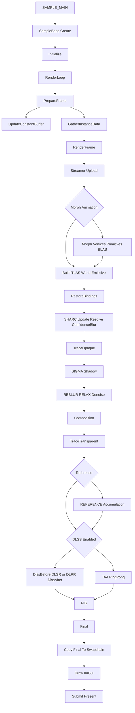

# rendering_pipeline

## Overview
`Source/NRDSample.cpp` 中的 `Sample` 是 NRD Sample 的主渲染样例类，负责从 NRI 设备/资源初始化到每帧路径追踪、NRD 降噪、DLSS/TAA/NIS 后处理、拷贝到 swapchain 与 present 的完整渲染管线。

该管线以 compute shader 为主，依赖 TLAS/BLAS、bindless 材质纹理、NRD resource snapshot、SHARC cache 与多组 ping-pong history texture 维持实时路径追踪和时域复用。

## Responsibilities
- 创建 NRI device、graphics queue、fence、streamer、swapchain、command buffer、pipeline layout、descriptor pool、compute pipelines、buffer/texture/resource descriptors。
- 创建并维护 NRD integration，初始化 REBLUR、RELAX、SIGMA、REFERENCE denoiser，并在每帧写入 `nrd::CommonSettings` 与各 denoiser settings。
- 加载场景、生成测试/动画对象、构建静态 BLAS、每帧聚合 instance data 并重建 `TLAS_World` / `TLAS_Emissive`。
- 每帧执行 UI/input 更新、相机与动画更新、history reset 判断、global constant buffer 更新、instance/TLAS 数据 streaming。
- 录制并提交 GPU 渲染命令：stream upload、morph mesh 更新、TLAS build、SHARC update/resolve、opaque trace、NRD denoise、composition、transparent trace、DLSS/TAA/NIS、final pass、UI 绘制、present。
- 跟踪 texture state，使用 `BuildOptimizedTransitions` 只发出必要 barrier，并在 NRD wrapper 不恢复初始状态时同步回 `m_TextureStates`。

## Involved Files (no line numbers)
- Source/NRDSample.cpp
- External/NRIFramework/Include/NRIFramework.h
- External/NRIFramework/Source/SampleBase.cpp
- Shaders/MorphMeshUpdateVertices.cs.hlsl
- Shaders/MorphMeshUpdatePrimitives.cs.hlsl
- Shaders/SharcUpdate.cs.hlsl
- Shaders/SharcResolve.cs.hlsl
- Shaders/ConfidenceBlur.cs.hlsl
- Shaders/TraceOpaque.cs.hlsl
- Shaders/Composition.cs.hlsl
- Shaders/TraceTransparent.cs.hlsl
- Shaders/Taa.cs.hlsl
- Shaders/DlssBefore.cs.hlsl
- Shaders/DlssAfter.cs.hlsl
- Shaders/Final.cs.hlsl
- Shaders/Include/Shared.hlsli
- Shaders/Include/RaytracingShared.hlsli

## Architecture
入口链路：`SAMPLE_MAIN(Sample, 0)` 在 NRIFramework 中生成 `main`，创建 `Sample` 后调用 `SampleBase::Create`，成功后进入 `SampleBase::RenderLoop`；`RenderLoop` 每帧顺序调用 `PrepareFrame(i)` 与 `RenderFrame(i)`。

初始化阶段由 `Sample::Initialize` 串联：
- 枚举 adapter，创建 NRI device，获取 Core/Helper/RayTracing/Streamer/SwapChain/Upscaler interface，取得 graphics queue 并创建 frame fence。
- 创建 `m_Streamer`，用于 dynamic constant buffer、instance data、TLAS instance buffer 等每帧上传。
- 创建 NIS upscaler；如果命令行允许 DLSS，则按 quality 创建 DLSR 和 DLRR，并根据 upscaler props 调整 `m_RenderResolution` 与最小 resolution scale。
- 创建 `m_NRD` integration；同一实例中注册 REBLUR、RELAX、SIGMA、REFERENCE，支持 D3D12/Vulkan auto wrapper 或直接 NRI wrapper。
- `LoadScene` 加载 proxy cube 与目标 glTF 场景，按场景调整 exposure、bounce、meter scale 等默认设置；随后可补 Bistro 内部玻璃面并生成 animated cubes。
- 建立 resource 容器大小后依次执行 `CreateSwapChain`、`CreateCommandBuffers`、`CreatePipelineLayoutAndDescriptorPool`、`CreatePipelines`、`CreateAccelerationStructures`、`CreateResourcesAndDescriptors`、`CreateDescriptorSets`、`UploadStaticData`。

核心资源模型：
- `Pipeline` 枚举全部映射到 compute pipeline：MorphMeshUpdateVertices、MorphMeshUpdatePrimitives、SharcUpdate、SharcResolve、ConfidenceBlur、TraceOpaque、Composition、TraceTransparent、Taa、Final、DlssBefore、DlssAfter。
- `Texture` 枚举保存主要 render target/history：ViewZ、Mv、Normal_Roughness、PsrThroughput、BaseColor_Metalness、DirectLighting、DirectEmission、Shadow、Diff/Spec、Unfiltered_*、Validation、Composed、SHARC gradient ping-pong、ComposedDiff、ComposedSpec_ViewZ、TAA history ping-pong、DlssOutput、PreFinal、Final、DLRR guide textures 以及场景只读纹理。
- `Buffer` 枚举保存 morph mesh 数据、InstanceData、PrimitiveData、SHARC hash/accumulated/resolved、TLAS scratch 等。
- `CreateTexture` 为非只读纹理同时创建 SRV 与 UAV，并把初始 access/layout 记录到 `m_TextureStates`；`CreateBuffer` 根据 usage 创建 structured buffer / storage structured buffer view。

Descriptor/绑定布局：
- `SET_ROOT`：root constant buffer、`TLAS_World`、`TLAS_Emissive`、`InstanceData`、`PrimitiveData`、`MorphPrimitivePositions`。
- `SET_OTHER`：普通 pass 使用的 texture/storage texture，按 pass 分配 `TraceOpaque`、`Composition`、`TraceTransparent`、`TaaPing/Pong`、`Final`、`DlssBefore/After`、SHARC update 与 confidence blur ping-pong descriptor set。
- `SET_RAY_TRACING`：静态随机/采样纹理加材质 bindless 纹理数组，每个 material 绑定 baseColor、roughnessMetalness、normal、emissive。
- `SET_SHARC`：`SharcHashEntries`、`SharcAccumulated`、`SharcResolved` 三个 storage buffer。
- `SET_MORPH`：morph pose/update primitives 使用的 structured/storage buffer。
- `RestoreBindings` 在 NRD、DLSS/NIS 或其他外部调度后恢复 descriptor pool、compute pipeline layout、global constant buffer、ray tracing set、SHARC set、两个 TLAS 与核心 structured buffer root descriptor。

Acceleration structure 生命周期：
- 初始化时 `CreateAccelerationStructures` 按材质和动态能力把场景实例分为 opaque、transparent、emissive、other/dynamic；静态实例合并成 `BLAS_MergedOpaque`、`BLAS_MergedTransparent`、`BLAS_MergedEmissive`，动态或 morph mesh 建独立 BLAS。
- 初始化 BLAS 构建完成后读取 compacted size，再创建 compacted BLAS 并替换临时 BLAS。
- 每帧 `GatherInstanceData` 根据当前相机相对坐标、动态对象、材质 flag、previous transform、morph 信息生成 `m_InstanceData`、`m_WorldTlasData`、`m_LightTlasData`，并通过 streamer 上传。
- 每帧 `RenderFrame` 用 streamed TLAS instance buffer 构建 `TLAS_World` 和 `TLAS_Emissive`；morph animation 存在时先更新 morph vertex/primitive buffer，并 build/update 对应 BLAS。

每帧 CPU 准备阶段 `PrepareFrame`：
- 保存上一帧 settings 与 camera state，处理快捷键、ImGui UI、NRD/路径追踪/材质/世界/测试参数。
- 更新 camera desc、自由飞行输入、模拟相机运动、场景动画、太阳动画、animated objects。
- 当 denoiser、ortho、RR 或首帧等状态变化时设置 `m_ForceHistoryReset`；emission 强度变化会缩短 accumulated frame 数，避免历史拖影。
- 根据 adaptive accumulation 和 FPS 估算 REBLUR/RELAX/SIGMA 最大历史帧数。
- 调用 `UpdateConstantBuffer` 写入 `GlobalConstants`：当前/上一帧矩阵、jitter、分辨率、太阳方向、camera global pos、hit distance、TAA/prev-frame confidence、DLSS/RR/SR 标志、debug/on-screen mode、采样数、PSR、SHARC、lobe trimming 等。
- 调用 `GatherInstanceData` 准备本帧 shader instance data 与 TLAS input。

每帧 GPU 管线 `RenderFrame` 详细顺序：
1. 计算 render rect、dispatch grid、NRD `CommonSettings`；填入当前/上一帧矩阵、motion vector scale、jitter、resource/rect size、denoising range、split screen、debug、frameIndex、history reset、history confidence 与 validation 标志；调用 `m_NRD.NewFrame()` 和 `m_NRD.SetCommonSettings()`。
2. `BeginCommandBuffer` 后先执行 `Streamer`：把 streamer 中排队的 constant/instance/TLAS upload 复制到目标资源；首帧同时把 `SharcAccumulated` 转为 copy destination 以便清零。
3. 可选 `Morph mesh`：若当前 animation 有 morph mesh 且未暂停或需要首帧刷新，则执行 `MorphMeshUpdateVertices` 写 `MorphPositions`/`MorphAttributes`，再执行 `MorphMeshUpdatePrimitives` 写 `PrimitiveData`/`MorphPrimitivePositions`，最后 build/update morph BLAS。
4. `TLAS`：用 `m_WorldTlasDataLocation` 与 `m_LightTlasDataLocation` 分别 build `TLAS_World` 与 `TLAS_Emissive`；首帧清零 `SharcAccumulated`；随后把 `InstanceData` 转回 shader resource，把 SHARC buffer 转为 storage。
5. `RestoreBindings`：绑定 global constant buffer、ray tracing bindless textures、SHARC buffer、TLAS、InstanceData、PrimitiveData、MorphPrimitivePositions。
6. `SHARC & History confidence`：`SharcUpdate` 在 `Gradient_StoredPing/Pong` 与 `Gradient_Ping` 间更新 radiance/cache；`SharcResolve` resolve SHARC entries；随后 `ConfidenceBlur` 对 `Gradient_Ping/Pong` 做 5 次 ping-pong blur，为 NRD diffuse/spec confidence 输入提供平滑结果。
7. `Trace opaque`：执行主路径追踪 compute pass。输入上一阶段可读的 `ComposedDiff`、`ComposedSpec_ViewZ`，输出 `Mv`、`ViewZ`、`Normal_Roughness`、`BaseColor_Metalness`、`DirectLighting`、`DirectEmission`、`PsrThroughput`、`Unfiltered_Penumbra`、`Unfiltered_Translucency`、`Unfiltered_Diff`、`Unfiltered_Spec`，SH 模式下还输出 `Unfiltered_DiffSh` 与 `Unfiltered_SpecSh`。
8. `Shadow denoising`：当 `NRD_MODE < OCCLUSION` 时，设置 SIGMA light direction，调用 NRD `SIGMA_SHADOW`，把 unfiltered penumbra/translucency 降噪到 `Shadow`。
9. `Opaque denoising`：根据 `m_Settings.denoiser` 选择 REBLUR 或 RELAX；根据 `NRD_MODE` 与 `NRD_COMBINED` 选择 diffuse/spec、SH、occlusion 或 directional occlusion 的 denoiser id；设置 hit distance 和 lobe angle 等参数后调用 `Denoise`。`Denoise` 将 `Mv`、`Normal_Roughness`、`ViewZ`、Validation、unfiltered diffuse/spec、confidence、shadow、reference signal 等 texture 填入 `nrd::ResourceSnapshot`，再通过 D3D12/VK auto wrapper 或 NRI wrapper 调度 NRD。
10. `Composition`：读取 `ViewZ`、`Normal_Roughness`、`BaseColor_Metalness`、direct lighting/emission、PSR throughput、`Shadow`、降噪后的 `Diff`/`Spec`，输出 `ComposedDiff` 与 `ComposedSpec_ViewZ`，形成不透明表面的中间合成结果。
11. `Trace transparent`：读取 `ComposedDiff` 与 `ComposedSpec_ViewZ`，追踪玻璃/透明路径并写最终 render-resolution `Composed`，同时更新 `Mv` 与 `Normal_Roughness` 供后续 DLSS/TAA/显示使用。
12. `Reference accumulation`：如果 denoiser 是 REFERENCE，修改 split screen 后调用 NRD `REFERENCE`，在 `Composed` 上执行参考累积，并再次 `RestoreBindings`。
13. 输出分支：若 `IsDlssEnabled()` 为 true，先在 `DlssBefore` pass 生成 RR guide textures；随后调用 `CmdDispatchUpscale`，RR 模式走 `m_DLRR` 并提供 denoiser guide，SR 模式走 `m_DLSR` 并提供 MV/depth guide；最后 `DlssAfter` 处理 `DlssOutput`。若 DLSS 未启用，则执行 `Taa` pass，在 `TaaHistoryPing/Pong` 间 ping-pong 输出。
14. `NIS`：从 `DlssOutput` 或当前 TAA history 读取，使用 NIS upscaler/sharpener 输出 `PreFinal`；根据 SDR/HDR scale 选择对应 NIS 实例。
15. `Final`：读取 `PreFinal`、`Composed`、`Validation`，输出 swapchain 格式的 `Final`，用于 debug overlay、validation overlay、显示模式等最终合成。
16. Acquire swapchain texture，将 `Final` 转为 copy source，将 back buffer 转为 copy destination，执行 `CmdCopyTexture`。
17. UI pass：back buffer 转为 color attachment，上传并绘制 ImGui，结束后转为 present layout。
18. `EndCommandBuffer` 后提交 graphics queue：等待 swapchain acquire semaphore，signal rendering finished semaphore 与 frame fence；结束 streamer frame，调用 `QueuePresent`；如果启用 FPS cap，在 CPU 侧 busy wait 到目标帧间隔。

简化流程图：

## Dependencies
- NRI：device、queue、fence、streamer、swapchain、descriptor、pipeline、barrier、ray tracing acceleration structure、upscaler dispatch。
- NRD：`nrd::Integration`、REBLUR、RELAX、SIGMA、REFERENCE、`nrd::CommonSettings`、`nrd::ResourceSnapshot`、D3D12/Vulkan auto wrapper。
- NRIFramework：`SampleBase` 生命周期、window/input/timer/camera/ImGui helper、shader loading、scene loading utilities。
- HLSL compute shaders：MorphMeshUpdate、SHARC、ConfidenceBlur、TraceOpaque、Composition、TraceTransparent、TAA、DLSS helper、Final。
- SHARC：hash/accumulated/resolved cache buffer 和 gradient confidence texture。
- DLSS/DLRR/NIS/FSR/XeSS 通过 NRI upscaler interface 间接接入。
- 场景与资源目录：`_Data/Scenes`、`_Shaders`、材质纹理、静态采样纹理、测试数据。

## Notes
- 管线几乎完全依赖 compute pipeline；即使是最终画面也是先写 `Texture::Final`，再 copy 到 swapchain，UI 才使用 color attachment 渲染。
- NRD、DLSS/NIS dispatch 可能改变绑定状态，源码在这些外部调度后显式调用 `RestoreBindings`，否则后续 compute pass 可能缺 root descriptor 或 descriptor set。
- `BuildOptimizedTransitions` 只有在状态变化或 UAV-to-UAV storage barrier 时发出 barrier；`m_TextureStates` 是跨 pass 状态正确性的关键。
- `NRD_RESTORE_INITIAL_STATE` 影响 NRD 后 texture state 是否自动恢复；若不恢复，`Denoise` 会把 `ResourceSnapshot` 中返回的状态写回 `m_TextureStates`。
- 首帧或 denoiser/ortho/RR 等状态变化会触发 `m_ForceHistoryReset`，直接影响 NRD accumulation mode、DLSS history reset 与 TAA/prev-frame confidence。
- `TraceOpaque` 在降噪前输出 unfiltered signal，`Composition` 在降噪后合成 opaque，`TraceTransparent` 在 opaque 合成结果之上处理透明/玻璃，因此透明物体不走同一套 opaque NRD radiance denoise。
- `TLAS_Emissive` 单独维护给 importance sampling / emissive tracing 使用；`TLAS_World` 用于主路径追踪。
- `PrepareFrame` 中的 UI 不只是显示逻辑，它会改变 denoiser、tracing mode、resolution scale、history reset、upscaler、动画和 shader reload，因此渲染行为与 UI 状态强耦合。
- `CreatePipelines(true)` 用于热重载 shader，重建 sample compute pipelines 并调用 `m_NRD.RecreatePipelines()`。
- `GatherInstanceData` 的注释明确要求 instance data 顺序必须匹配 BLAS geometry layout；修改 BLAS 分组或 instance 遍历顺序时需要同步检查 shader 索引假设。

## Callers
- `SAMPLE_MAIN(Sample, 0)` 创建 `Sample`，调用 `SampleBase::Create` 后进入 `SampleBase::RenderLoop`。
- `SampleBase::RenderLoop` 每帧调用 `PrepareFrame(i)`，随后调用 `RenderFrame(i)`。