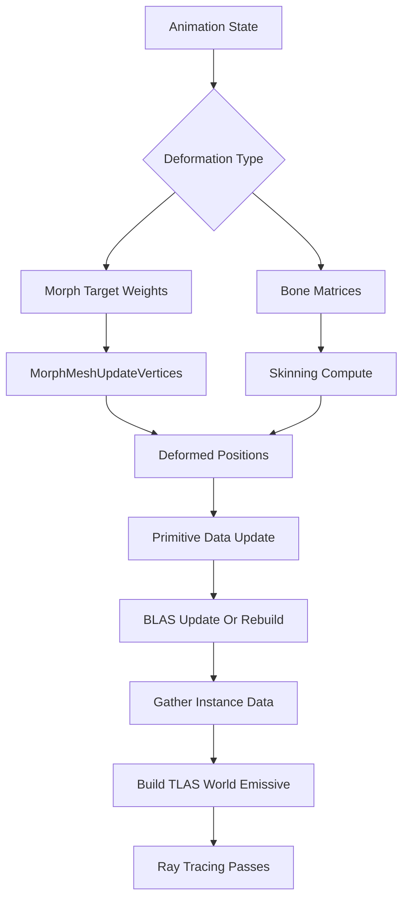

# skinning

## Overview
本 memory 记录 `Source/NRDSample.cpp` 中已实现的 morph mesh 动态几何更新流程，并补充它与 bone matrix skinning 在 ray tracing TLAS/BLAS 更新上的对应关系。

当前代码没有实现骨骼矩阵 skinning；`material.isSkin` 只是材质/着色标记，不等于 skeleton skinning。bone matrix skinning 部分是基于本项目 morph mesh 流程与 ray tracing 动态顶点规则的设计推导。

## Responsibilities
- 说明 morph mesh 在本项目中如何先更新变形后顶点/primitive 数据，再 build/update 对应 BLAS。
- 说明每帧 `GatherInstanceData` 如何生成 `InstanceData`、`TLAS_World` 和 `TLAS_Emissive` 的 instance 输入。
- 说明 TLAS 与 BLAS 的职责边界：instance 级刚体变换走 TLAS，顶点级形变走 BLAS。
- 给出 bone matrix skinning 接入 ray tracing 时应采用的更新顺序、资源需求和常见风险。

## Involved Files (no line numbers)
- Source/NRDSample.cpp
- Shaders/MorphMeshUpdateVertices.cs.hlsl
- Shaders/MorphMeshUpdatePrimitives.cs.hlsl
- Shaders/TraceOpaque.cs.hlsl
- Shaders/TraceTransparent.cs.hlsl
- Shaders/Include/Shared.hlsli
- Shaders/Include/RaytracingShared.hlsli
- External/NRIFramework/Include/NRIFramework.h
- External/NRIFramework/Source/SampleBase.cpp

## Architecture
TLAS/BLAS 职责边界：
- TLAS 保存 instance transform、mask、instance id 和 BLAS handle，适合表达整个对象的平移、旋转、缩放、显隐、材质分组或 emissive/transparent 分类变化。
- BLAS 保存几何三角形的空间层级，依赖 vertex buffer、index buffer、geometry layout 和 build/update flags。只要顶点位置在 BLAS 局部几何空间中发生变化，就需要更新或重建 BLAS。
- 因此，刚体动画一般只需要更新 TLAS；morph target 或 bone matrix skinning 这类顶点级变形需要先更新顶点 buffer，再 update/refit 或 rebuild BLAS，最后再更新 TLAS。

本项目已实现的 morph mesh 初始化流程：
- `CreateAccelerationStructures` 会识别 `mesh.HasMorphTargets()`，对 morph mesh 使用 `BLAS_MORPH_MESH_BUILD_BITS`，并记录 BLAS build/update scratch 最大需求到 `m_MorphMeshScratchSize`。
- 初始化 BLAS 时，morph mesh 的 vertex stride 使用 `sizeof(float16_t4)`，初始顶点来自 `m_Scene.morphVertices` 中的 base pose。
- `CreateResourcesAndDescriptors` 创建 morph 相关 buffer：`MorphMeshIndices`、`MorphMeshVertices`、`MorphPositions`、`MorphAttributes`、`MorphPrimitivePositions`、`MorphMeshScratch`。其中 `MorphPositions` 同时带 `SHADER_RESOURCE`、`SHADER_RESOURCE_STORAGE`、`ACCELERATION_STRUCTURE_BUILD_INPUT`，说明它既被 compute pass 写入，也作为 BLAS build/update 的 vertex input。
- `CreatePipelines` 加载 `MorphMeshUpdateVertices.cs` 与 `MorphMeshUpdatePrimitives.cs` 两个 compute pipeline。
- `CreateDescriptorSets` 给 morph pass 绑定 base morph vertices、morph positions、attributes、indices、primitive data 和 morph primitive positions。

本项目已实现的每帧 morph mesh 更新流程：
```text
PrepareFrame
  -> 更新动画状态与全局常量
  -> GatherInstanceData
       -> 生成 InstanceData
       -> stream TLAS_World / TLAS_Emissive instance input
RenderFrame
  -> Streamer 上传本帧数据
  -> MorphMeshUpdateVertices
       -> 根据 morph target 权重写 MorphPositions / MorphAttributes
  -> MorphMeshUpdatePrimitives
       -> 根据当前/上一帧 morph positions 写 PrimitiveData / MorphPrimitivePositions
  -> CmdBuildBottomLevelAccelerationStructures
       -> 以 MorphPositions 作为 vertexBuffer build/update morph BLAS
  -> CmdBuildTopLevelAccelerationStructures
       -> 使用 streamed top-level instance data build TLAS_World / TLAS_Emissive
  -> TraceOpaque / TraceTransparent 使用新 TLAS/BLAS 追踪
```

morph mesh 的关键细节：
- `RenderFrame` 中 morph animation 条件成立时，先执行 `MorphMeshUpdateVertices`，每个 morph mesh instance 根据当前 active weights 计算当前帧顶点位置和属性。
- `MorphMeshUpdatePrimitives` 会同时使用当前帧与上一帧 morph position offset，更新 primitive 级数据。这对 motion vector、历史重投影、ray tracing shader 中的 previous state 逻辑很重要。
- morph BLAS 的 `bottomLevelGeometry.triangles.vertexBuffer` 指向 `Buffer::MorphPositions`，index buffer 指向 `MorphMeshIndices`。
- 如果动画刚暂停，代码会选择 build；否则会设置 `src = accelerationStructure` 做 update。也就是说 topology 不变时优先走 BLAS update/refit 语义。
- morph BLAS 更新后，`PrimitiveData` 和 `MorphPrimitivePositions` 会转回 shader resource，供后续 ray tracing shader 读取。

`GatherInstanceData` 与 TLAS：
- 每帧清空并重新生成 `m_InstanceData`、`m_WorldTlasData`、`m_LightTlasData`。
- 静态 opaque、transparent、emissive 分别引用合并后的 `BLAS_MergedOpaque`、`BLAS_MergedTransparent`、`BLAS_MergedEmissive`。
- 动态实例使用 `meshInstance.blasIndex` 指向独立 BLAS，并把当前 object-to-world transform、mask、instance id、BLAS handle 写入 `nri::TopLevelInstance`。
- `InstanceData` 顺序必须匹配 BLAS geometry layout；源码注释明确说明这一点。修改 BLAS 分组、instance 遍历顺序或动态几何布局时，要同步检查 shader 端 instance/primitive 索引假设。
- `RenderFrame` 用 streamer 返回的 `m_WorldTlasDataLocation` 与 `m_LightTlasDataLocation` 分别 build `TLAS_World` 和 `TLAS_Emissive`。

bone matrix skinning 的对应流程推导：
```text
CPU/GPU 更新 skeleton pose
  -> 计算 bone matrices 或 dual quaternion palette
  -> Skinning compute pass
       -> 读取 bind-pose vertex + bone indices + weights + bone matrices
       -> 写 SkinnedPositions / SkinnedAttributes
       -> 可选写 previous skinned positions 或 velocity/motion 辅助数据
  -> 可选 Primitive update pass
       -> 写 PrimitiveData / SkinnedPrimitivePositions
  -> BLAS update/refit 或 rebuild
       -> vertexBuffer = SkinnedPositions
       -> indexBuffer = 原 index buffer
       -> topology 和 geometry layout 不变时可 update/refit
  -> GatherInstanceData / TLAS input
       -> instance transform 仍写 TLAS
       -> BLAS handle 指向 skinned mesh 的动态 BLAS
  -> TLAS build/update
  -> ray tracing pass
```

如果把 bone matrix skinning 接入本项目，可复用 morph mesh 的管线位置和资源思想：
- 在 `RenderFrame` 的 TLAS build 之前插入 skinning compute pass，位置类似当前 morph mesh update。
- 为 skinned mesh 创建类似 `MorphPositions` 的 `SkinnedPositions`，必须带 `ACCELERATION_STRUCTURE_BUILD_INPUT` 和 storage usage。
- 若 shader 需要 previous position、motion vector、normal/tangent 或 primitive 级数据，应同时维护当前帧和上一帧 skinned buffer，或维护能重建 previous state 的矩阵/primitive 数据。
- 对每个 skinned mesh 创建可更新 BLAS；若只是角色整体移动，更新 TLAS transform 即可；若骨骼改变了顶点位置，必须更新 BLAS。
- topology 不变、vertex/index layout 不变时可以做 BLAS update/refit；如果 topology、index buffer、geometry 数量、format 或 stride 改变，则需要 rebuild 或重新创建 BLAS。

简化流程图：


## Dependencies
- NRI ray tracing acceleration structure API：`CreateCommittedAccelerationStructure`、`CmdBuildBottomLevelAccelerationStructures`、`CmdBuildTopLevelAccelerationStructures`、scratch buffer alignment 与 acceleration structure handle。
- NRI streamer：每帧上传 `InstanceData`、`TLAS_World` instance data、`TLAS_Emissive` instance data。
- Morph mesh compute shaders：`MorphMeshUpdateVertices.cs.hlsl`、`MorphMeshUpdatePrimitives.cs.hlsl`。
- Ray tracing shaders：`TraceOpaque.cs.hlsl`、`TraceTransparent.cs.hlsl` 依赖 TLAS、instance data、primitive data、morph primitive positions 等输入。
- Scene data：`utils::Mesh`、`utils::MeshInstance`、`utils::Instance`、material flags、morph targets、indices、primitive metadata。
- 若未来接入 bone matrix skinning，还需要 skeleton pose、bone inverse bind matrices、bone indices/weights buffer、bone matrix palette buffer、skinned vertex/attribute buffer 和对应 descriptor set/pipeline。

## Notes
- 当前 `NRDSample.cpp` 没有 skeleton/bone matrix skinning 实现；不要把 `material.isSkin` 理解为骨骼蒙皮，它只是 skin material flag。
- 动态顶点变形不能只更新 TLAS。TLAS 只知道 instance transform；BLAS 的三角形包围层级仍基于 vertex buffer。顶点位置改变后，如果 BLAS 不更新，ray tracing 会使用旧几何求交。
- 只更新 BLAS 也不一定足够。shader 端若使用 previous transform、previous position、primitive normal/tangent、motion vector 或 denoiser history 信息，也要同步更新这些辅助数据。
- BLAS update/refit 性能通常好于 rebuild，但大幅度骨骼形变或长时间 refit 会降低 BVH 质量，可能需要周期性 rebuild。
- morph mesh 当前把 current/previous morph position offset 传给 primitive update；bone skinning 若要得到稳定 motion vector，也应保留上一帧 skinned positions 或上一帧 bone matrices。
- 如果 skinned mesh 只是一个角色整体移动但骨骼 pose 不变，TLAS transform 更新即可；如果骨骼 pose 改变，顶点局部位置改变，必须更新 BLAS。
- 多个 instance 共享同一个 skinned mesh 时，要区分“共享同一套变形结果”与“每个 instance 独立动画状态”。后者通常需要每个动画状态一份 skinned vertex buffer 和独立 BLAS。

## Callers
- `SampleBase::RenderLoop` 每帧调用 `Sample::PrepareFrame` 和 `Sample::RenderFrame`。
- `Sample::RenderFrame` 在 TLAS build 之前执行 morph mesh vertex/primitive/BLAS 更新。
- `Sample::GatherInstanceData` 每帧准备 `TLAS_World`、`TLAS_Emissive` 与 shader `InstanceData` 输入。